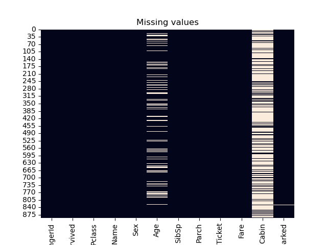

# Titanic dataset

## Data Exploratory Analisys (DEA)

### Formal exploration
- __shape__ => 891 x 12

- __Variables types :__

    | Name        | Type    | 
    | :-----      | :-----  |
    | PassengerId | int64   |
    | Survived    | int64   |
    | Pclass      | int64   |
    | Name        | object  |
    | Sex         | object  |
    | Age         | float64 |
    | SibSp       | int64   |
    | Parch       | int64   |
    | Ticket      | object  |
    | Fare        | float64 |
    | Cabin       | object  |
    | Embarked    | object  |

- __Types value counts :__
    | Type        | Count   | 
    | :-----      | :-----  |
    | int64       | 5       |
    | object      | 5       |
    | float64     | 2       |

    

- __Missing values :__
    

    | Feature     | Missing rate |
    | :-----      | :-----       |
    |PassengerId  |  0.000000    |
    |Survived     |  0.000000    |
    |Pclass       |  0.000000    |
    |Name         |  0.000000    |
    |Sex          |  0.000000    |
    |SibSp        |  0.000000    |
    |Parch        |  0.000000    |
    |Ticket       |  0.000000    |
    |Fare         |  0.000000    |
    |Embarked     |  0.002245    |
    |Age          |  0.198653    |
    |Cabin        |  0.771044    |

### Deep Exploration

- __Target visualisation :__
    | Class  | Count  |
    | :----- | :----- |
    |   0    |   549  |
    |   1    |   342  |

- __Features visualisation :__
    - Continious features :
        * Parch histogram :
            
        * PassengerID histogram :
            
        * SibSp histogram :
            
        * Survived histogram :
            
    - Object features : 
        Sex ----------------------------------['male' 'female']
        Embarked ---------------------------['S' 'C' 'Q' nan]

- __Other graphs :__    
    - Heatmap :
        

    - Pairplot :
        
        

### Conclusion
 Features :
  - Cabin => too many nan => drop
  - PassengerId => too many variance => drop
  - Name => same
  - Embarked => maybe usefull (try)

Feature 'Sex' =>
    Large difference => try split dataset men/female => two models

## Preprocessing
    

        

